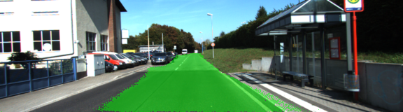
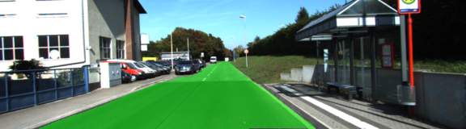
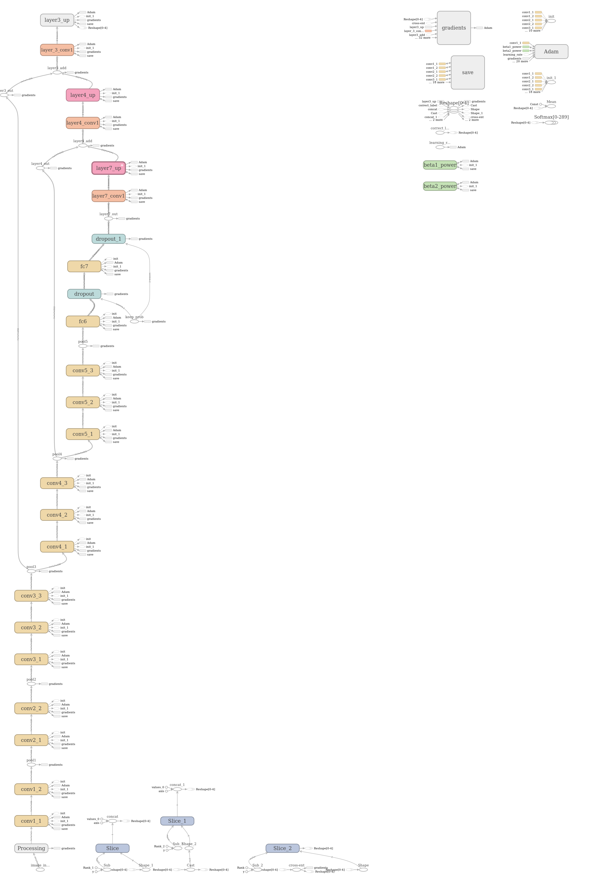
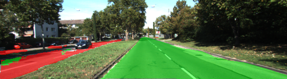

# CarND Semantic Segmentation

---


This is my (Anton Varfolomeev) solution for the Semantic Segmentation project

---

### Introduction

The goal of this project is to build a system that will label the pixels of a road in images using a Fully Convolutional Network (FCN).

To perform this task, FCN was constructed and trained using the:
    
    - TensorFlow 1.4
    - Pre-trained VGG16 network
    - Ideas from the FCN paper [1] and U-Net paper [2]
    - Kitti road dataset [3]


### Code

Code of the project is located in files `main.py` (network construction and traingin) and `helper.py` (data loading,
data augmentation, results saving)


### Notes and comments 


#### General TensorFlow setup

To make TF and system as a whole more stable, I limited the resources 
available for single TF process (`main.py', lines 208-214):
```
    config = tf.ConfigProto(
       gpu_options = tf.GPUOptions(per_process_gpu_memory_fraction=0.8),
       device_count = {'GPU': 1}
    )

    with tf.Session(config=config) as sess:
        ....
```
I used batch size of 8 on one of my computers (with two 1080Ti), but main training
was performed on another computer, where I was forced to limit batch size to
only 2 images (due to the problems with the power supply, it seems).

#### Network construction
I started with the graph structure recommended in the lecture (and the paper),
but soon noticed that:
- Results on difficult cases were not good


- The bottleneck in the center of the network (only 2 channels) was too narrow

 

Comparing current model to the models I worked with before, I decided to
increase model capacity a little bit - and made following changes:
- Preserve the original depth of the VGG16 layers (4096, 512 and 256 channels)
- Add ReLU activation after each convolutional layer.

It really improved the result:




I know that that the space of possible network architectures and hyperparameters 
is huge - but it's exploration requires a really large dataset
(CityScapes at least) - and appropriate amount of time... 

Here is a picture of the resulted graph (better to view full-scale image):




#### Data augmentation

But for this network the amount of training data provided by KITTI road dataset
was too small. To improve situation, I added data augmentation cosisting of:
- Five crops (80% of the image: four corners and central part)
- Image mirroring

That increased the amount of training data by a factor of 12. Due to the extremely small
amount of original data, I performed all transformations inside one epoch - to increase
epoch size from 289 to 3468 images.

The code for the data augmentation is in the file `helper.py`, inside the **`get_batches_fn`** 
(lines 82-144).

#### Three-class segmentation

I suggested that some errors may be caused by confusion between the 'road' and 'other road' classed,
and implemented three-class segmentation.

Changes were maid to the **`gen_batches_fn()`** function (lines 80 and 145-151 in the file `helper.py`)
and to the **`gen_test_output`** function (lines 182-185 in the file `helper.py`)
  
'Other road' segmentation by itself is not so good - but introduction of this class certainly improved the
segmentation of the main road.




#### Training procedure

For the training I used AdamOptimizer - but with manually adjusted learning rate. Resulted error dropped
from 0.8 to 0.0013 after 50 epochs. Results are in the /runs/20171122_045143 folder.

#### CityScape training

I've started training on the CityScape dataset - but it will take long time (and large network) to report
some good results.

 
 ## Literature

1. Long, E. Shelhamer, and T. Darrell, “Fully Convolutional Networks for Semantic Segmentation,” arXiv:1411.4038, Nov. 2014.
2. O.Ronneberger, P. Fischer, and T. Brox, “U-Net: Convolutional Networks for Biomedical Image Segmentation,” arXiv:1505.04597, May 2015.
3. http://www.cvlibs.net/datasets/kitti/eval_road.php

